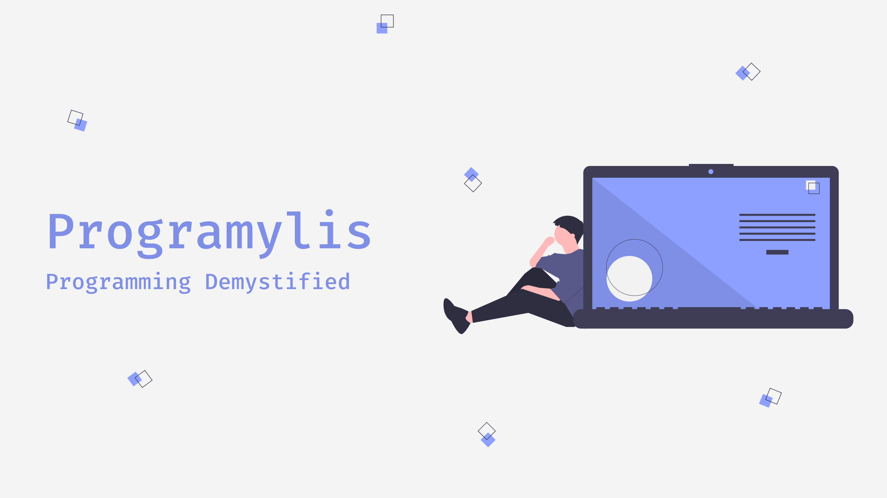

<h1>Programylis</h1>
A collection of source code and resources for my youtube videos

## Resources

|     |                                                    Resource Link                                                    |                Youtube Link                 | Blog Post |                                            Stats                                             |
| :-: | :-----------------------------------------------------------------------------------------------------------------: | :-----------------------------------------: | :-------: | :------------------------------------------------------------------------------------------: |
|  1  | [JavaScript Symbols - The Lesser Known Primitive (with examples)](https://github.com/bhumijgupta/Exploring-Symbols) | https://www.youtube.com/watch?v=41DJ-Qhsc5U |     -     |  |
|  2  |                              Setup automated deployment to server using only Git hooks                              |                  Upcoming                   | Upcoming  |                                              -                                               |  |

## Feedback

If you would like to request/suggest any topic/improvement for my video, [click here](https://github.com/bhumijgupta/youtube-projects/issues/new)
